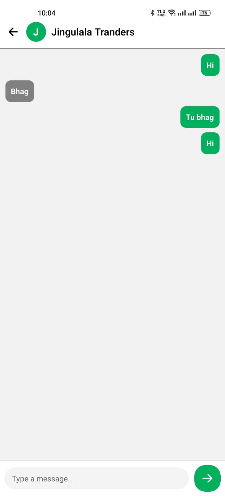

# 🛍️ Dripify - React Native E-Commerce App

**Dripify** is a stylish, Firebase-powered e-commerce mobile app built using **React Native (Expo)**. It enables users to browse, search, and buy products while allowing sellers to manage listings, communicate with buyers, and handle orders all in one smooth experience.

---

## 🚀 Features

### 👤 User Authentication
- Signup/Login using **Email & Password** via Firebase Authentication
- Stores additional user data: **Name**, **Phone Number**, and **Gender**

### 🛍️ Product Categories
- Organized into main categories and subcategories:
  - **Bottoms**: Jeans, Shorts, Dress Pants, Trousers  
  - **Uppers**: Polo, T-Shirts, Dress Shirts  
  - **Suits**: Men’s, Women’s  
  - **Shoes**: Slippers, Casual Shoes, Dress Shoes, Joggers  
  - **Accessories**: Hats, Rings, Watches  

### 📦 Product Management (Seller)
- Upload products with:
  - Name, Brand, Model, Description, Price, Image (from Gallery)
- Edit/Delete listings
- Seller contact info displayed on Product Detail screen

### 🔍 Product Browsing
- Search by **name, brand, model, and price**
- View full product details including:
  - Product image, description
  - Quantity selector
  - Comments & ratings
  - Seller contact

### 🛒 Cart & Checkout
- Add products to cart (stored in user subcollection)
- View all items in cart with total
- Confirm delivery address before placing order
- Place single combined order for all cart items

### 📄 Orders
#### Buyer:
- View order history
- Cancel active orders

#### Seller:
- View orders placed for their products
- Mark orders as **Dispatched** or **Completed**

### 💬 Messaging
- One-on-one real-time messaging between buyers and sellers
- Full chat history for each conversation

### ✨ Animations & UI
- Beautiful UI with **Ionicons**
- **Lottie animations** for smooth loading & splash screens
- Flash sale banner with animated countdown

---

## 🛠️ Tech Stack

- **React Native** (with **Expo**)
- **Firebase**
  - Authentication
  - Firestore (Database)
  - Firebase Storage
- **Lottie** (React Native Lottie)
- **React Navigation**
- **Ionicons**

---

## 📥 Getting Started

### 1. Clone the Repository
```bash
git clone https://github.com/MalikAdilll/Nimbus.git
cd Nimbus
npm install
npx expo start


```

## 📱 App Screenshots

<div align="center">
  <table>
    <tr>
      <td><a href="assets/screenshots/1.jpeg"></a></td>
      <td><a href="assets/screenshots/2.jpeg"></a></td>
      <td><a href="assets/screenshots/3.jpeg"></a></td>
    </tr>
    <tr>
      <td><a href="assets/screenshots/4.jpeg"></a></td>
      <td><a href="assets/screenshots/5.jpeg"></a></td>
      <td><a href="assets/screenshots/6.jpeg"></a></td>
    </tr>
    <tr>
      <td><a href="assets/screenshots/7.jpeg"></a></td>
      <td><a href="assets/screenshots/8.jpeg"></a></td>
      <td><a href="assets/screenshots/9.jpeg"></a></td>
    </tr>
    <tr>
      <td><a href="assets/screenshots/10.jpeg"></a></td>
      <td><a href="assets/screenshots/11.jpeg"></a></td>
      <td><a href="assets/screenshots/12.jpeg"></a></td>
    </tr>
  </table>
</div>


